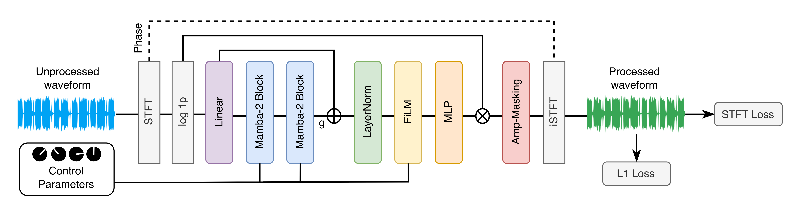
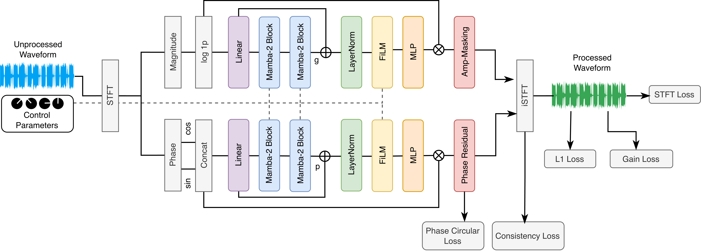

# SDRC-Mamba2: Phase-Aware Spectral Modeling of Analog Compressors with Selective State-Space Models

This repository contains the official PyTorch implementation for the paper:

**Phase-Aware Spectral Modeling of Analog Compressors with Selective State-Space Models**  
*Andrei Balykin, Ivan Blekanov*

## Abstract
High-fidelity virtual analog modeling of analog dynamic range compressors remains a challenging problem due to their memory-dependent, time-varying behavior, where long-term envelope evolution interacts with short-term nonlinear coloration. This work introduces a time-frequency modeling framework that integrates a causal STFT front-end with selective state-space processing using a Mamba-2 backbone. The baseline model applies a two-layer Mamba-2 architecture to predict magnitude-domain amplification masks, enabling end-to-end training in the spectral domain. Extending the baseline, the advanced model introduces a dedicated phase branch that estimates bounded phase increments and is optimized with auxiliary objectives for phase reconstruction and frame-level gain accuracy. Evaluations on three benchmark compressor datasets demonstrate state-of-the-art performance across objective metrics in our experimental setup. A MUSHRA listening study supports these findings, showing that the phase-aware model is generally preferred over raw waveform-based approaches in perceptual quality.

## Model Overview
High-fidelity virtual analog modeling of dynamic range compressors with a causal STFT front-end and selective state-space models.

Baseline model (`mamba2_mag_mask.yaml`): magnitude-only processing with amplification-masking.


Advanced model (`mamba2_mag_phase_mask.yaml`): magnitude + phase processing with additional losses: `L1 + STFT + phase circular + STFT consistency + gain`.


## Data
- LA2A: [SignalTrain-LA2A (Hugging Face)](https://huggingface.co/datasets/drscotthawley/SignalTrain-LA2A)
- CL1B: [Optical Dynamic Range Compressors LA-2A / CL-1B (Kaggle)](https://www.kaggle.com/datasets/riccardosimionato/optical-dynamic-range-compressors-la-2a-cl-1b)
  - Download data (`data_prep/download_data_cl1b.ipynb`).
  - Split and unpack train/val/test (`data_prep/unpack_pickle.ipynb`).
- Alesis3630: [VCA Compressors Dataset (Kaggle)](https://www.kaggle.com/datasets/johngolt/vca-compressors-dataset)

## Setup
Update dataset paths in `data/__init__.py`:
- `la2a`
- `cl1b`
- `alesis3630`

Install required Python packages used by scripts:
- `torch`, `torchaudio`, `pytorch-lightning`
- `auraloss`, `thop`, `librosa`, `pyloudnorm`
- `einops`, `pyyaml`, `tqdm`

## Training
Run the full experiment suite (all models, all datasets, and ablations):

```bash
(cd run && bash run_all_exps.sh)
```

Train a single model (baseline):

```bash
python train.py --config_path ./configs/release/mamba2_mag_mask.yaml --dataset cl1b
```

Train a single model (advanced):

```bash
python train.py --config_path ./configs/release/mamba2_mag_phase_mask.yaml --dataset cl1b
```

## Evaluation
Run objective evaluation for a dataset:

```bash
python test.py --config_path ./configs/release/mamba2_mag_phase_mask.yaml --dataset la2a
```

Supported datasets: `la2a`, `cl1b`, `alesis3630`.

## Inference
Generate output audio with trained checkpoints:

```bash
python inference_audio.py --config_path ./configs/release/mamba2_mag_phase_mask.yaml --dataset alesis3630
```

Notes:
- Inference sources/parameters are defined in `INFER_ITEMS` in `inference_audio.py`.
- Outputs are saved to `./experiments/<dataset>/inference/<model_id>/`.

## Profiling
Measure GMACs, parameter count, and realtime factor:

```bash
python profiling_gpu.py --config_path ./configs/release/mamba2_mag_phase_mask.yaml --dataset la2a
```

## Acknowledgments
This repository includes adapted/inspired components with citations embedded in source headers:

- `models/base.py` and related base and TCN classes adapted from:
  - Steinmetz, C. J., & Reiss, J. D. (2022). Efficient neural networks for real-time modeling of analog dynamic range compression. Proceedings of the 152nd AES Convention.
  - Repository: https://github.com/csteinmetz1/micro-tcn

- `models/raw/s4_raw.py` adapted from:
  - Yin, H., Cheng, G., Steinmetz, C. J., Yuan, R., Stern, R. M., & Dannenberg, R. B. Modeling Analog Dynamic Range Compressors using Deep Learning and State-space Models.
  - Repository: https://github.com/ineffab1e-vista/s4-dynamic-range-compressor

- `models/raw/mamba_raw.py` inspired by:
  - Simionato, R., & Fasciani, S. Modeling Time-Variant Responses of Optical Compressors with Selective State Space Models.
  - Repository: https://github.com/RiccardoVib/Optical-DRC-with-Selective-SSMs

## License
MIT
